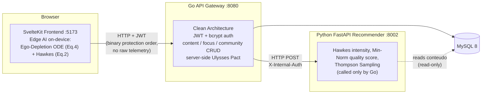

# Be-Productive

**English** | [Português (Brasil)](README.pt-BR.md)

[](https://doi.org/10.70773/revistatopicos/781363235)  

A mental-health-oriented social network where the recommendation algorithm optimizes for the user's cognitive reserve instead of raw engagement.

---

## What this is

Be-Productive is the **reference implementation of a published, peer-reviewed academic paper**:

> **Arquitetura Algorítmica para Atenção Sustentável: O Modelo Be-Productive como Resposta à Sobrecarga Cognitiva no Capitalismo de Vigilância**
> *(Algorithmic Architecture for Sustainable Attention: The Be-Productive Model as a Response to Cognitive Overload in Surveillance Capitalism)*
> Revista Tópicos (ISSN 2965-6672, Qualis A2). DOI: [10.70773/revistatopicos/781363235](https://doi.org/10.70773/revistatopicos/781363235)

The paper presents the architecture as a **technical possibility** — it argues the approach is *technically viable* and lays out a pragmatic engineering path, without claiming to be the final word. This repository is that possibility built and exercised: a runnable, testable, three-tier prototype that implements the paper's mathematical model end to end, plus a standalone experiment that reproduces the paper's headline statistical result under a stricter, confound-free design (see [Verified results](#verified-results)). The published paper itself is unmodified; this code is its evolution, not a replacement for it.

It was developed as a final-year capstone project (**TCC — Trabalho de Conclusão de Curso**) at **FAETERJ-RIO**.

- Claim-by-claim traceability between the paper and the code: [`docs/en/paper-code-truth-map.md`](docs/en/paper-code-truth-map.md)
- Reproducible statistical proof: [`recommender/abm_results/statistical_proof.md`](recommender/abm_results/statistical_proof.md)

### What this implementation adds beyond the paper's proposal

| Paper concept | In this implementation |
|---|---|
| ABM validation (d = 3.25) | A **confound-free** experiment: recovery (μ_rest) is identical in both arms and load is endogenous; d = 3.25 reproduced by a seeded run, with an **ablation table** and a **sanity check** (mechanisms off → d ≈ 0) |
| Hawkes processes (Eq. 2) | A **real** self-exciting point process, summed over event history (not a single exponential of the mean delay) |
| Thompson Sampling | Beta posteriors that **actually update** from observed reward |
| Min-Norm filtering (Eq. 3) | **Exercised** with an auditable text-based safety baseline over title, body, and tags |
| Edge AI / on-device inference | The fatigue ODE + Hawkes process run **in the browser** (`frontend/src/lib/fatigue.ts`); raw telemetry never leaves the device |
| Ulysses Pact | Absolute Mode is **enforced server-side** from the active focus session, not from a client-controlled flag |
| — (production hardening) | bcrypt instead of SHA-256, JWT-derived identity (no IDOR), internal shared-secret guard between Go and the recommender |

## Why it exists

Be-Productive frames itself as a "cognitive airbag": instead of maximizing raw engagement, it detects impulsive consumption patterns and introduces **positive friction**, while preserving the user's own declared intent (a "Ulysses Pact" the user sets for themselves, which the system then helps enforce).

Core features:

- **Focus Goals** — user-defined productivity/entertainment time budgets (Ulysses Pact)
- **Personalized feed** — content weighted by quality and well-being (Min-Norm, Eq. 3)
- **On-device positive friction** — desaturation and slowdown as cognitive reserve drops
- **Content moderation** — multi-objective safety aggregation

The project is candid about where it currently falls short of a production system: safety uses an auditable lexical baseline and ranking uses observable product signals, not trained safety/ALS models — see [`docs/en/roadmap.md`](docs/en/roadmap.md) and [`docs/en/milestones.md`](docs/en/milestones.md).

## Interdisciplinary relevance

The paper is classified under Engineering, Health Sciences, and Applied Social Sciences, and the underlying model is meant to be reusable outside computer science:

- **Mental health & clinical psychology** — the cognitive-reserve ODE and Hawkes-based detection of "residual excitation" as instrumentation for studying attentional fatigue and digital dependency.
- **Education / EdTech** — study environments that protect deliberate (System 2) attention instead of fragmenting it.
- **HCI & ethical UX** — "positive friction" and value-aligned recommendation as a replicable design pattern.
- **Digital policy** — a concrete technical reference point for digital-wellbeing regulation and algorithmic transparency debates.
- **Behavioral economics** — the Ulysses Pact, hyperbolic discounting, and pre-commitment implemented in software.
- **Privacy / data protection** — on-device inference (Edge AI) as a privacy-by-design reference pattern.

See [`docs/en/impact.md`](docs/en/impact.md) for the full discussion.

## Architecture



The frontend talks **only** to the Go backend, never directly to Python. Fatigue inference (the Ego-Depletion ODE and the bi-kernel Hawkes process from the paper) runs **on-device** in the browser, so scroll velocity, context switches, reserve, and friction level never leave the client — the server receives only a binary protection order for feed generation. Python is invoked exclusively by Go.

The repository also ships a standalone **Agent-Based Simulation** (`recommender/src/abm`) used purely for offline statistical validation — it is not part of the runtime request path.

```
Be-Productive/
├── frontend/          # SvelteKit + TypeScript (on-device Edge AI)
├── backend/           # Go + MySQL (API gateway, auth, focus)
├── recommender/        # Python + FastAPI + numpy/scipy (scoring + ABM)
├── docs/               # Internal docs: docs/en (English) + docs/pt-BR (Português), mirrored 1:1
└── setup.bat / start.bat / stop.bat / view-logs.bat   # Windows convenience scripts
```

## Quickstart

Verified in this repository's actual scripts and manifests — not aspirational.

### Prerequisites

- Node.js **20.19+** (required by Vite 7)
- Go **1.25+**
- Python **3.10+**
- MySQL **8.0+**

### 1. Database

```bash
mysql -u root -p -e "CREATE DATABASE be_productive;"
```

### 2. Backend (Go, port 8080)

```bash
cd backend
cp .env.example .env      # set DB_*, JWT_SECRET, RECOMMENDER_URL, RECOMMENDER_SHARED_SECRET
go mod download
go run cmd/seeder/main.go # applies backend/migrations/*.up.sql + backend/scripts/mock_data.sql
go run cmd/server/main.go
```

### 3. Recommender (Python, port 8002)

```bash
cd recommender
python -m venv venv && venv\Scripts\activate   # Windows; `source venv/bin/activate` on Linux/macOS
pip install -r requirements.txt
uvicorn src.api.main:app --port 8002 --reload
```

The recommender listens on port **8002** across local scripts, examples, and Compose.

### 4. Frontend (SvelteKit, port 5173)

```bash
cd frontend
cp .env.example .env
npm install
npm run dev
```

### All-in-one (Windows)

The repo root ships batch scripts that automate the same steps: `setup.bat` (install everything), then `go run cmd/seeder/main.go` once, then `start.bat` (launches all three services with logs under `logs/`), `stop.bat`, and `view-logs.bat`.

## Verified results

The paper's headline result is `Cohen's d = 3.25` on the reserve-AUC metric between the Be-Productive arm and a baseline arm, from an Agent-Based Simulation (N=1000, T=60, seeded). This repository ships a **confound-free reproduction** of that experiment — recovery (μ_rest) is identical across arms and load is endogenous, so the only difference between arms is the algorithm's own behavior:

| Metric | Value |
|---|---|
| Cohen's d — reserve AUC | **3.25** |
| Cohen's d — bounded R_final/R_max metric | 3.62 |
| Mann-Whitney U p-value | ≈ 3.8 × 10⁻²⁹⁵ |
| Median KL divergence (declared intent vs. actual consumption) | 0.874 (baseline) → 0.205 (Be-Productive) |

**Ablation** (attributing the effect to each mechanism):

| Configuration | Cohen's d (AUC) |
|---|---|
| Full model | 3.25 |
| Min-Norm only | 0.35 |
| Friction only | 2.57 |
| Steering only (Thompson Sampling + Hawkes) | −0.01 |
| Sanity check — all mechanisms off | ≈ 0.02 |

The sanity-check row is the important one: with every mechanism disabled, the effect vanishes, which is evidence the effect is produced by the mechanisms and not baked into the simulation harness.

Source of truth: [`recommender/abm_results/statistical_proof.md`](recommender/abm_results/statistical_proof.md), regenerable with:

```bash
cd recommender
python -m src.abm.run_simulation
```

This regenerates `statistical_proof.md` plus `fig_1_ego_depletion.png`, `fig_2_kl_divergence.png`, and `fig_3_robustness_manifold.png` under `recommender/abm_results/` — these are committed, intentionally-generated research artifacts, not stale build output. This repository does not ship copies of the paper's own published figures; the ones under `recommender/abm_results/` are produced by this repository's own code, independently of the paper.

## Testing & CI

Re-verified while preparing this documentation (commands run directly against this worktree):

| Layer | Command | Result |
|---|---|---|
| Go backend | `cd backend && go test ./...` | All 6 packages with tests pass (`go test ./... -v` reports 73 passing test cases) |
| Python recommender | `cd recommender && python -m pytest src/ -q` | **89 passed**, across 14 test files under `src/**/tests/` (includes the ABM sanity check) |
| Frontend (unit) | `cd frontend && npm run test` | **11 passed**, across 2 Vitest files (`api.test.ts`, `friction-logic.test.ts`) |
| Frontend (types) | `cd frontend && npm run check` | `svelte-check` — 0 errors, 0 warnings |
| Frontend (E2E) | `cd frontend && npx playwright test` | 3 Playwright specs exist (`auth`, `feed`, `focus`, plus a `global-setup`) — not executed here; they require the full stack (MySQL + all three services) running live |

The workflow in [`.github/workflows/ci.yml`](.github/workflows/ci.yml) runs backend tests, recommender tests, frontend type-check/tests, and the frontend production build on every pull request.

`CLAUDE.md` previously stated the frontend had "no test runner configured" — that was inaccurate (`vitest` is a real devDependency and the two files above are real tests); this has been corrected in that file.

## Environment variables

**Backend** (`backend/.env`, see `backend/.env.example`)

```env
SERVER_HOST=localhost
SERVER_PORT=8080
DB_HOST=localhost
DB_PORT=3306
DB_USER=root
DB_PASSWORD=
DB_NAME=be_productive
JWT_SECRET=change_me_to_a_secure_random_string
RECOMMENDER_URL=http://localhost:8002
RECOMMENDER_SHARED_SECRET=
```

**Recommender** (`recommender/.env`, optional — internal endpoints are open in dev when unset)

```env
RECOMMENDER_SHARED_SECRET=   # must match the backend's value
```

**Frontend** (`frontend/.env`, see `frontend/.env.example`)

```env
VITE_API_URL=http://localhost:8080/api/v1
```

## Main endpoints (via Go)

```
GET  /health

POST /api/v1/auth/register
POST /api/v1/auth/login

GET  /api/v1/users/{id}            PUT /api/v1/users/{id}
GET  /api/v1/users/{id}/topics     POST /api/v1/users/{id}/topics
GET  /api/v1/users/{id}/settings   PUT /api/v1/users/{id}/settings

GET  /api/v1/feed                  # delegates scoring to the Python recommender

POST /api/v1/content                       GET  /api/v1/content/{id}
POST /api/v1/content/{id}/feedback         POST /api/v1/content/{id}/report

GET  /api/v1/communities                   GET  /api/v1/communities/me
POST /api/v1/communities/{id}/join         POST /api/v1/communities/{id}/leave

POST /api/v1/focus/goals                   GET  /api/v1/focus/goals
POST /api/v1/focus/sessions                PUT  /api/v1/focus/sessions/{id}
GET  /api/v1/focus/sessions/{id}/goals     GET  /api/v1/focus/sessions/{id}/report
```

All routes except `/health` and the two auth routes require a JWT (`Authorization: Bearer <token>`); the acting user is derived from the token claims, not from request bodies or query parameters. Full source: `backend/internal/adapter/http/router/router.go`.

## Documentation

Internal docs live under [`docs/`](docs/README.md), mirrored in English (`docs/en/`) and Portuguese (`docs/pt-BR/`) with identical filenames and structure:

| Document | Content | English | Português (Brasil) |
|---|---|---|---|
| Architecture | Three-tier architecture, data flow, on-device Edge AI | [`docs/en/architecture.md`](docs/en/architecture.md) | [`docs/pt-BR/architecture.md`](docs/pt-BR/architecture.md) |
| Reproducibility | How to reproduce the d = 3.25 experiment, ablation, figures | [`docs/en/reproducibility.md`](docs/en/reproducibility.md) | [`docs/pt-BR/reproducibility.md`](docs/pt-BR/reproducibility.md) |
| Paper ↔ Code truth map | Paper-claim ↔ code-location traceability, including known gaps | [`docs/en/paper-code-truth-map.md`](docs/en/paper-code-truth-map.md) | [`docs/pt-BR/paper-code-truth-map.md`](docs/pt-BR/paper-code-truth-map.md) |
| Academic impact | Academic purpose and interdisciplinary applications | [`docs/en/impact.md`](docs/en/impact.md) | [`docs/pt-BR/impact.md`](docs/pt-BR/impact.md) |
| Roadmap | Phased evolution roadmap | [`docs/en/roadmap.md`](docs/en/roadmap.md) | [`docs/pt-BR/roadmap.md`](docs/pt-BR/roadmap.md) |
| Security posture | Applied security posture and hardening TODOs (not the vulnerability-disclosure policy — see [`SECURITY.md`](SECURITY.md) at the repo root for that) | [`docs/en/security.md`](docs/en/security.md) | [`docs/pt-BR/security.md`](docs/pt-BR/security.md) |

Per-layer READMEs — currently Portuguese only, not yet mirrored in English as a separate file (an explicit scope decision, not an oversight): [`backend/README.md`](backend/README.md) · [`recommender/README.md`](recommender/README.md) · [`frontend/README.md`](frontend/README.md).

`CLAUDE.md`, `CONTRIBUTING.md`, `SECURITY.md`, `CODE_OF_CONDUCT.md`, and `CHANGELOG.md` at the repository root are in English.

## Roadmap

See [`docs/en/roadmap.md`](docs/en/roadmap.md) for the remaining path toward trained/ONNX models and in-vivo validation. Implemented engineering milestones are tracked in [`docs/en/milestones.md`](docs/en/milestones.md).

## License

**No license file currently exists in this repository.** In the absence of an explicit `LICENSE`, default copyright rules apply: all rights are reserved by the author, and no reuse, redistribution, or derivative work is licensed to third parties. This is an open decision that belongs to the author, not something this documentation pass resolves.

If you want to reference this work academically, cite the published paper:

```
Melo, F. S. S. et al. Arquitetura Algorítmica para Atenção Sustentável:
O Modelo Be-Productive como Resposta à Sobrecarga Cognitiva no Capitalismo
de Vigilância. Revista Tópicos, 2026. DOI: 10.70773/revistatopicos/781363235.
```

## Author

Academic capstone project (TCC) at **FAETERJ-RIO**, materialized in the peer-reviewed paper cited above (citation: `Melo, F. S. S. et al.`). Repository: [github.com/FellypeMelo/Be-Productive-TCC](https://github.com/FellypeMelo/Be-Productive-TCC).

---

Reference implementation of the model published under DOI [10.70773/revistatopicos/781363235](https://doi.org/10.70773/revistatopicos/781363235). The paper itself is untouched; this repository is its executable, reproducible evolution.
